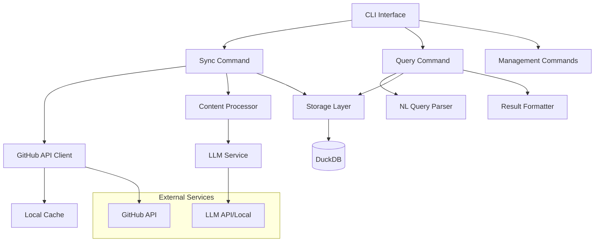

# Design Document

## Overview

The `gh-star-search` extension is a GitHub CLI extension built in Go that provides intelligent search capabilities over a user's starred repositories. The system combines structured metadata extraction with unstructured content processing using LLMs to enable natural language queries against a local DuckDB database.

The architecture follows a modular design with clear separation between data ingestion, processing, storage, and querying components. The extension leverages the existing GitHub CLI authentication and follows GitHub CLI conventions for seamless integration.

## Architecture

### High-Level Architecture



### Component Architecture

The system is organized into the following main packages:

- **cmd/**: CLI command implementations (sync, query, list, info, stats, clear)
- **internal/github/**: GitHub API client and repository fetching logic
- **internal/processor/**: Content extraction and LLM processing
- **internal/storage/**: DuckDB database operations and schema management
- **internal/query/**: Natural language query parsing and SQL generation
- **internal/config/**: Configuration management for LLM backends and settings
- **internal/cache/**: Local file caching for repository content

## Components and Interfaces

### 1. CLI Interface Layer

**Package**: `cmd/`

The CLI layer implements the GitHub CLI extension interface with the following commands:

```go
// Main command structure
type Command interface {
    Execute(ctx context.Context, args []string) error
    Usage() string
    Flags() []Flag
}

// Command implementations
type SyncCommand struct {
    githubClient github.Client
    processor    processor.Service
    storage      storage.Repository
}

type QueryCommand struct {
    queryParser  query.Parser
    storage      storage.Repository
    formatter    formatter.Service
}
```

### 2. GitHub API Client

**Package**: `internal/github`

Handles all GitHub API interactions with rate limiting and authentication:

```go
type Client interface {
    GetStarredRepos(ctx context.Context, username string) ([]Repository, error)
    GetRepositoryContent(ctx context.Context, repo Repository, paths []string) ([]Content, error)
    GetRepositoryMetadata(ctx context.Context, repo Repository) (*Metadata, error)
}

type Repository struct {
    FullName        string    `json:"full_name"`
    Description     string    `json:"description"`
    Language        string    `json:"language"`
    StargazersCount int       `json:"stargazers_count"`
    ForksCount      int       `json:"forks_count"`
    UpdatedAt       time.Time `json:"updated_at"`
    CreatedAt       time.Time `json:"created_at"`
    Topics          []string  `json:"topics"`
    License         *License  `json:"license"`
    Size            int       `json:"size"`
}

type Content struct {
    Path     string `json:"path"`
    Type     string `json:"type"`
    Content  string `json:"content"`
    Size     int    `json:"size"`
    Encoding string `json:"encoding"`
}
```

### 3. Content Processor

**Package**: `internal/processor`

Extracts and processes unstructured content using configurable LLM backends:

```go
type Service interface {
    ProcessRepository(ctx context.Context, repo github.Repository, content []github.Content) (*ProcessedRepo, error)
    ExtractContent(ctx context.Context, repo github.Repository) ([]github.Content, error)
    GenerateSummary(ctx context.Context, chunks []ContentChunk) (*Summary, error)
}

type ContentChunk struct {
    Source   string `json:"source"`   // file path or section
    Type     string `json:"type"`     // readme, code, docs, etc.
    Content  string `json:"content"`
    Tokens   int    `json:"tokens"`
    Priority int    `json:"priority"` // for size limit handling
}

type Summary struct {
    Purpose      string   `json:"purpose"`
    Technologies []string `json:"technologies"`
    UseCases     []string `json:"use_cases"`
    Features     []string `json:"features"`
    Installation string   `json:"installation"`
    Usage        string   `json:"usage"`
}

type ProcessedRepo struct {
    Repository github.Repository `json:"repository"`
    Summary    Summary           `json:"summary"`
    Chunks     []ContentChunk    `json:"chunks"`
    ProcessedAt time.Time        `json:"processed_at"`
}
```

### 4. LLM Service

**Package**: `internal/llm`

Provides abstraction over different LLM backends (OpenAI, Anthropic, local models):

```go
type Service interface {
    Summarize(ctx context.Context, prompt string, content string) (*SummaryResponse, error)
    ParseQuery(ctx context.Context, query string, schema Schema) (*QueryResponse, error)
    Configure(config Config) error
}

type Config struct {
    Provider string            `json:"provider"` // openai, anthropic, local
    Model    string            `json:"model"`
    APIKey   string            `json:"api_key,omitempty"`
    BaseURL  string            `json:"base_url,omitempty"`
    Options  map[string]string `json:"options,omitempty"`
}

type SummaryResponse struct {
    Purpose      string   `json:"purpose"`
    Technologies []string `json:"technologies"`
    UseCases     []string `json:"use_cases"`
    Features     []string `json:"features"`
    Installation string   `json:"installation"`
    Usage        string   `json:"usage"`
}
```

### 5. Storage Layer

**Package**: `internal/storage`

Manages DuckDB database operations with optimized schema for search:

```go
type Repository interface {
    Initialize(ctx context.Context) error
    StoreRepository(ctx context.Context, repo ProcessedRepo) error
    UpdateRepository(ctx context.Context, repo ProcessedRepo) error
    DeleteRepository(ctx context.Context, fullName string) error
    SearchRepositories(ctx context.Context, query string) ([]SearchResult, error)
    GetRepository(ctx context.Context, fullName string) (*StoredRepo, error)
    ListRepositories(ctx context.Context, limit, offset int) ([]StoredRepo, error)
    GetStats(ctx context.Context) (*Stats, error)
    Clear(ctx context.Context) error
}

type SearchResult struct {
    Repository StoredRepo `json:"repository"`
    Score      float64    `json:"score"`
    Matches    []Match    `json:"matches"`
}

type Match struct {
    Field   string `json:"field"`
    Content string `json:"content"`
    Score   float64 `json:"score"`
}
```

### 6. Query Parser

**Package**: `internal/query`

Converts natural language queries to DuckDB SQL:

```go
type Parser interface {
    Parse(ctx context.Context, naturalQuery string) (*ParsedQuery, error)
    ValidateSQL(sql string) error
    ExplainQuery(sql string) (*QueryPlan, error)
}

type ParsedQuery struct {
    SQL         string            `json:"sql"`
    Parameters  map[string]string `json:"parameters"`
    Explanation string            `json:"explanation"`
    Confidence  float64           `json:"confidence"`
}
```

## Data Models

### Database Schema

The DuckDB database uses the following optimized schema:

```sql
-- Main repositories table
CREATE TABLE repositories (
    id VARCHAR PRIMARY KEY,
    full_name VARCHAR UNIQUE NOT NULL,
    description TEXT,
    language VARCHAR,
    stargazers_count INTEGER,
    forks_count INTEGER,
    size_kb INTEGER,
    created_at TIMESTAMP,
    updated_at TIMESTAMP,
    last_synced TIMESTAMP,
    topics VARCHAR[], -- Array of topic strings
    license_name VARCHAR,
    license_spdx_id VARCHAR,

    -- Processed summary fields
    purpose TEXT,
    technologies VARCHAR[], -- Array of technology strings
    use_cases VARCHAR[], -- Array of use case strings
    features VARCHAR[], -- Array of feature strings
    installation_instructions TEXT,
    usage_instructions TEXT,

    -- Search optimization
    search_vector FLOAT[384], -- Embedding vector for semantic search
    content_hash VARCHAR -- Hash of processed content for change detection
);

-- Content chunks table for detailed search
CREATE TABLE content_chunks (
    id VARCHAR PRIMARY KEY,
    repository_id VARCHAR REFERENCES repositories(id),
    source_path VARCHAR NOT NULL,
    chunk_type VARCHAR NOT NULL, -- readme, code, docs, etc.
    content TEXT NOT NULL,
    tokens INTEGER,
    priority INTEGER,
    embedding FLOAT[384], -- Chunk-level embeddings
    created_at TIMESTAMP DEFAULT CURRENT_TIMESTAMP
);

-- Full-text search indexes
CREATE INDEX idx_repositories_fts ON repositories USING fts(
    full_name, description, purpose, installation_instructions, usage_instructions
);

CREATE INDEX idx_content_chunks_fts ON content_chunks USING fts(content);

-- Performance indexes
CREATE INDEX idx_repositories_language ON repositories(language);
CREATE INDEX idx_repositories_updated_at ON repositories(updated_at);
CREATE INDEX idx_repositories_stargazers ON repositories(stargazers_count);
CREATE INDEX idx_content_chunks_repo_type ON content_chunks(repository_id, chunk_type);
```

### Configuration Model

```go
type Config struct {
    Database DatabaseConfig `json:"database"`
    LLM      LLMConfig      `json:"llm"`
    GitHub   GitHubConfig   `json:"github"`
    Cache    CacheConfig    `json:"cache"`
}

type DatabaseConfig struct {
    Path           string `json:"path"`
    MaxConnections int    `json:"max_connections"`
    QueryTimeout   string `json:"query_timeout"`
}

type LLMConfig struct {
    DefaultProvider string            `json:"default_provider"`
    Providers       map[string]Config `json:"providers"`
    MaxTokens       int               `json:"max_tokens"`
    Temperature     float64           `json:"temperature"`
}

type CacheConfig struct {
    Directory   string `json:"directory"`
    MaxSizeMB   int    `json:"max_size_mb"`
    TTLHours    int    `json:"ttl_hours"`
    CleanupFreq string `json:"cleanup_frequency"`
}
```

## Error Handling

### Error Types

```go
type ErrorType string

const (
    ErrTypeGitHubAPI     ErrorType = "github_api"
    ErrTypeLLM          ErrorType = "llm"
    ErrTypeDatabase     ErrorType = "database"
    ErrTypeValidation   ErrorType = "validation"
    ErrTypeRateLimit    ErrorType = "rate_limit"
    ErrTypeNotFound     ErrorType = "not_found"
    ErrTypeConfig       ErrorType = "config"
)

type Error struct {
    Type    ErrorType `json:"type"`
    Message string    `json:"message"`
    Code    string    `json:"code"`
    Cause   error     `json:"-"`
}
```

### Error Handling Strategy

1. **GitHub API Errors**: Implement exponential backoff for rate limits, graceful degradation for unavailable repositories
1. **LLM Errors**: Fallback to structured metadata when LLM processing fails, retry with different models
1. **Database Errors**: Transaction rollback, connection pool management, corruption recovery
1. **Validation Errors**: Clear user feedback with suggestions for correction
1. **Configuration Errors**: Helpful setup guidance and validation

## Testing Strategy

### Unit Testing

- **GitHub Client**: Mock GitHub API responses, test rate limiting and error handling
- **Content Processor**: Test content extraction logic, chunking algorithms, LLM integration
- **Storage Layer**: Test database operations, schema migrations, query performance
- **Query Parser**: Test natural language to SQL conversion, edge cases, validation

### Integration Testing

- **End-to-End Sync**: Test complete repository ingestion pipeline with real GitHub data
- **Search Functionality**: Test query parsing and result accuracy with sample datasets
- **CLI Interface**: Test command-line interactions, flag parsing, output formatting
- **Database Performance**: Test with large datasets (1000+ repositories)

### Test Data Strategy

```go
// Test fixtures for consistent testing
type TestRepository struct {
    Repository github.Repository
    Content    []github.Content
    Expected   ProcessedRepo
}

// Mock services for isolated testing
type MockGitHubClient struct {
    repositories []github.Repository
    content      map[string][]github.Content
    errors       map[string]error
}

type MockLLMService struct {
    responses map[string]llm.SummaryResponse
    errors    map[string]error
}
```

### Performance Testing

- **Sync Performance**: Measure ingestion speed for various repository sizes
- **Query Performance**: Benchmark search response times with different query types
- **Memory Usage**: Monitor memory consumption during large sync operations
- **Database Size**: Track database growth and optimization effectiveness

## Security Considerations

### Authentication and Authorization

- Leverage GitHub CLI's existing authentication mechanism
- Store sensitive configuration (API keys) using system keychain when available
- Validate GitHub token permissions before operations

### Data Privacy

- Local-only data storage by default
- Clear data retention policies and cleanup options
- Secure handling of repository content in memory and cache

### Input Validation

- Sanitize all user inputs for SQL injection prevention
- Validate natural language queries for malicious content
- Limit query complexity to prevent resource exhaustion

## Performance Optimizations

### Database Optimizations

- Use DuckDB's columnar storage for analytical queries
- Implement proper indexing strategy for common search patterns
- Batch insert operations for improved sync performance
- Use prepared statements for repeated queries

### Content Processing Optimizations

- Implement intelligent content prioritization to stay within size limits
- Use streaming processing for large repositories
- Cache LLM responses to avoid reprocessing unchanged content
- Parallel processing of independent repositories during sync

### Memory Management

- Stream large file contents instead of loading entirely into memory
- Implement connection pooling for database operations
- Use context cancellation for long-running operations
- Garbage collection optimization for large datasets

## Deployment and Distribution

### GitHub CLI Extension Distribution

```yaml
# .github/workflows/release.yml
name: Release
on:
  push:
    tags: ['v*']
jobs:
  release:
    runs-on: ubuntu-latest
    steps:
      - uses: actions/checkout@v3
      - uses: actions/setup-go@v3
        with:
          go-version: '1.21'
      - name: Build binaries
        run: |
          GOOS=linux GOARCH=amd64 go build -o gh-star-search-linux-amd64
          GOOS=darwin GOARCH=amd64 go build -o gh-star-search-darwin-amd64
          GOOS=darwin GOARCH=arm64 go build -o gh-star-search-darwin-arm64
          GOOS=windows GOARCH=amd64 go build -o gh-star-search-windows-amd64.exe
      - name: Create release
        uses: softprops/action-gh-release@v1
        with:
          files: gh-star-search-*
```

### Installation Methods

1. **GitHub CLI Extension Registry**: `gh extension install kyleking/gh-star-search`
1. **Manual Installation**: Download binary and place in PATH
1. **Package Managers**: Homebrew formula, Scoop manifest for Windows

### Configuration Management

- Default configuration in `~/.config/gh-star-search/config.json`
- Environment variable overrides for CI/CD environments
- Command-line flags for one-time configuration changes

