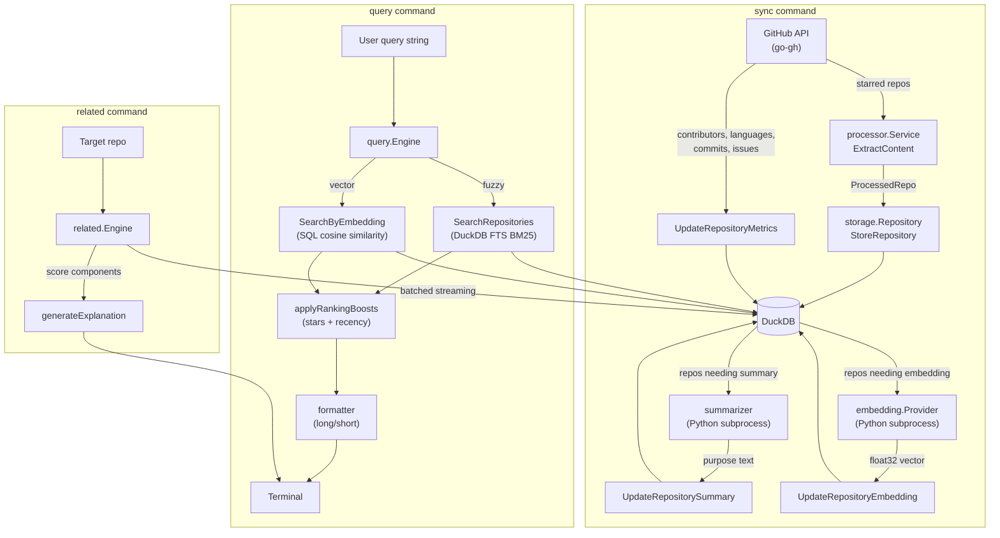

# Design

## Architecture

gh-star-search is a single-binary GitHub CLI extension built in Go. It indexes a user's starred repositories into an embedded DuckDB database and provides fuzzy/vector search, related repository discovery, and summarization.

### Package Structure

```
cmd/                      CLI command definitions (urfave/cli/v3)
internal/
  cache/                  File-based cache with TTL and background cleanup
  config/                 Multi-source configuration (file, env, CLI flags)
  embedding/              Vector embedding providers (local Python)
  errors/                 Structured error types with context and suggestions
  formatter/              Output formatting (long-form and short-form)
  github/                 GitHub API client wrapping go-gh
  logging/                Structured logging via slog
  processor/              Content extraction and chunking from repositories
  query/                  Search engine (DuckDB FTS + vector cosine similarity)
  related/                Related repository discovery engine
  storage/                DuckDB persistence layer
  python/                 Embedded Python scripts & uv integration
  summarizer/             Python-based text summarization (sentence-transformers)
  types/                  Shared type definitions
```

### Data Flow



### Key Interfaces

All major subsystems are defined as interfaces to enable testing and future alternative implementations:

| Interface            | Implementation                      | Purpose                                                     |
| -------------------- | ----------------------------------- | ----------------------------------------------------------- |
| `storage.Repository` | `DuckDBRepository`                  | All database operations (CRUD, search, metrics, embeddings) |
| `github.Client`      | `clientImpl`                        | GitHub API calls (starred repos, metadata, contributors)    |
| `query.Engine`       | `SearchEngine`                      | Search dispatch (fuzzy/vector) with scoring                 |
| `related.Engine`     | `EngineImpl`                        | Related repository discovery with streaming batches         |
| `embedding.Provider` | `LocalProvider`, `DisabledProvider` | Vector embedding generation                                 |
| `processor.Service`  | `serviceImpl`                       | Content extraction and chunking                             |
| `cache.Cache`        | `FileCache`                         | TTL-based file cache with background cleanup                |

## Design Decisions

### Embedded DuckDB over SQLite

DuckDB was chosen for its analytical query performance, native JSON column support, and columnar storage -- all suited to the metadata-heavy, read-heavy workload of searching across repository attributes. Connection pooling is configured with 10 max open / 5 idle connections and 30-second query timeouts.

### DuckDB FTS with Ranking Boosts

Fuzzy search uses DuckDB's native FTS extension with BM25 scoring across `full_name`, `description`, `purpose`, `topics_text`, and `contributors_text`. The FTS index is rebuilt after each sync via `PRAGMA create_fts_index` (Porter stemmer, English stopwords). Two ranking boosts are applied multiplicatively on top of the FTS score:

- **Star boost**: `1 + 0.1 * log10(stars + 1) / 6` -- a subtle logarithmic signal that avoids dominating relevance
- **Recency decay**: `1 - 0.2 * min(1, daysSinceUpdate / 365)` -- up to 20% penalty for repos not updated in a year

Scores are clamped to [0, 1.0]. Zero base scores are never boosted.

### Streaming Related Repository Discovery

The related engine processes repositories in batches of 100 and maintains a top-100 buffer to bound memory usage regardless of total repository count. Relatedness is a weighted composite of four signals:

| Signal              | Weight | Algorithm                                                          |
| ------------------- | ------ | ------------------------------------------------------------------ |
| Same organization   | 0.30   | Binary match on owner prefix                                       |
| Topic overlap       | 0.25   | Jaccard similarity of topic sets                                   |
| Shared contributors | 0.25   | Intersection of top-10 contributor sets, normalized by smaller set |
| Vector similarity   | 0.20   | Cosine similarity of repo embeddings                               |

Weights are renormalized across only the available (non-zero) components, so missing data gracefully reduces the score rather than penalizing it.

### External Python for ML (via uv)

Summarization and embedding generation delegate to Python subprocesses (`summarize.py`, `embed.py`) rather than embedding ML runtimes in Go. The Python scripts are embedded in the Go binary via `//go:embed` and extracted to `~/.cache/gh-star-search/python/` at runtime. Dependencies (`torch`, `transformers`, `sentence-transformers`) are managed by [uv](https://docs.astral.sh/uv/) via a shared `pyproject.toml`, which avoids duplicating the ~2GB torch environment across scripts. A `uv sync` warmup step runs before script invocations, handling first-run dependency installation with a generous timeout. The local embedding provider uses `intfloat/e5-small-v2` (384 dimensions) with a 60-second timeout.

### Incremental Sync with Content Hashing

Sync is incremental: repositories are re-processed only when their `content_hash` (SHA256 of extracted content) changes or when `last_synced` exceeds the staleness threshold (default 14 days). Metrics, summaries, and embeddings each have independent staleness checks so a partial failure in one phase does not block the others.

### SQL Injection Prevention

The storage layer rejects queries containing SQL keywords (`SELECT`, `DROP`, `INSERT`, etc.) before they reach DuckDB. All database operations use parameterized queries. This defense-in-depth approach protects against both accidental and intentional injection via the search input.

### Structured Error Types

The `errors` package provides typed errors (`ErrorType` enum: `github_api`, `database`, `validation`, `rate_limit`, etc.) with context maps, stack traces (filtered to project code), and user-facing suggestions. For example, a `rate_limit` error includes the reset time and suggests upgrading the GitHub token.

### Configuration Layering

Configuration is resolved in order: JSON file (`~/.config/gh-star-search/config.json`) -> environment variables (`GH_STAR_SEARCH_*`) -> CLI flags. Later sources override earlier ones. The config module validates constraints (log levels, timeouts, connection limits) at load time.

## Patterns

### Table-Driven Tests

All test files use Go's table-driven test pattern with `t.Run` subtests. Test setup that creates a DuckDB instance is extracted into `t.Helper()` functions with `t.Cleanup()` for teardown.

### Graceful Degradation

- Vector search returns an explicit error when embeddings are unavailable (no silent fallback to fuzzy)
- Partial metric sync failures are logged but do not abort the overall sync
- Missing summary/embedding data is excluded from scoring rather than treated as zero-match

### Interface-at-Consumer Pattern

Interfaces are defined in the packages that consume them (e.g., `query.Engine` is defined in `internal/query/`, not in the implementing package). This follows the Go convention of keeping interfaces small and close to usage.

## Testing

### Test Categories

- **Unit tests**: Scoring functions, tokenization, validation, formatting (`*_test.go` adjacent to source)
- **Integration tests**: Full command execution with in-memory DuckDB (`cmd/*_integration_test.go`)
- **VCR tests**: GitHub API interactions recorded to cassettes for deterministic replay (`internal/github/`)

### Key Test Coverage

| Area           | Tests                                                          | Focus                                                         |
| -------------- | -------------------------------------------------------------- | ------------------------------------------------------------- |
| Search scoring | `TestRecencyDecay`, `TestStarBoost`, `TestScoreClamping`       | Decay curve, logarithmic boost, edge cases                    |
| Storage search | `TestSearchRepositories`, `_EdgeCases`, `_SQLInjection`        | FTS BM25 matching, short queries, SQL keyword rejection       |
| CLI validation | `TestValidateQuery`, `TestValidateQueryFlags`, `TestFormatAge` | Input bounds, flag combinations, time formatting              |
| Related engine | `TestFindRelated`, `TestTopicOverlap`, `TestSharedContrib`     | Jaccard similarity, contributor intersection, batch streaming |
| Query engine   | `TestIdentifyMatchedFields`, `TestApplyRankingBoosts`          | Field matching, boost application                             |

### Running Tests

```bash
mise run test              # All tests with coverage
mise run bench             # Benchmarks
mise run lint              # golangci-lint (v2, 40+ rules)
mise run ci                # Full CI gate (tests + build)
```

## Further Reading

See [OPERATIONS.md](OPERATIONS.md) for operational details: schema management, configuration reference, cache eviction policy, rate limiting behavior, output format specification, and embedding/summarization setup.
